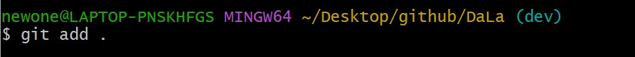

# DaLa - 搭拉项目介绍

## 一、加入项目

> 1. 安装git

下载地址：https://git-scm.com/download/win

> 2. 克隆远程仓库到本地

1. 创建`github`文件夹
2. 复制远程仓库地址


3. 右键打开`Git Bash`

4. `git clone`克隆远程仓库

```bash
git clone https://github.com/AGkite/DaLa.git
```


> 3. 项目开发

**注意：我们设计Dala仓库有两个项目分支，分别为：主分支`(master)`和开发分支`(dev)`。提交代码时先提交到`(dev)`分支，由另一个人确认代码没有冲突了再合并到`(master)`分支。防止多人开发时造成混乱。**

1. `cd Dala`进入 Dala 仓库

2. `git checkout <分支名称>` 切换到 dev 分支。命令行 `(master)` 变为 `(dev)` 切换成功。


3. 提交时简要写明此次提交增加修改了什么

- `git add .`加入所有修改到暂存区
- `git commit -m "<描述>"`标注提交信息
- `git push origin dev`推送到远程仓库的dev分支




> 4. 检查无误后合并分支

1. `git checkout master`切换到要合并的分支
2. `git merge dev`合并分支
3. `git push origin master`同步到远程仓库


完成一次同步。

> 5. Git 学习

学习地址：https://oschina.gitee.io/learn-git-branching/

工作原理：


## 二、搭建项目环境

> 1. 仓库目录简介

- `dala_flutter` 应用程序前端
- `dala_express` Express.js 框架后端
- `database` 数据库数据

> 2. 前端技术栈

| 技术栈  | 描述                | 版本   |
| ------- | ------------------- | ------ |
| Flutter | Android,IOS应用开发 | 3.19.5 |
| Gradle  | 构建项目            | 7.6.3  |
| Dart    | Dart语言            | latest |

> 3. 后端技术栈

| 技术栈     | 描述                 | 版本     |
| ---------- | -------------------- | -------- |
| Node.js    | JavaScript运行时环境 | v18.18.1 |
| Express.js | 后端应用程序框架     | 5.0      |
| MongoDB    | NoSQL数据库          | 7.0      |
| Redis      | 内存缓存             | latest   |
| JWT        | 登录鉴权             | latest   |
| Docker     | 部署容器             | latest   |
| MinIO      | 图片资源存储         | latest   |
| Lucene     | 全文检索             | latest   |
| Nginx      | Web 服务器           | 1.24.0   |

> 4. 开发工具

### **前端：**

- Android Studio

### **后端：**

- Visual Studio Code
- Postman

### **UI设计：**

- Axure
- ProcessOn

### **运维：**

- 阿里云服务器(Alibaba Cloud Linux)
- FinalShell

### 编写文档：

- Typora

- Word
- PowerPoint
- Excel

## 三、开发计划

### 1. 任务

- 学会 Git 多人协作开发
- 了解前后端开发流程
- 前端人员侧重学习Flutter
- 后端人员侧重学习Express.js、MongoDB
- 继续完善Axure原型

### 2. 任务细分

当前：

- 搭建好Git，Flutter，Android Studio，Express.js开发环境
- 拉取仓库，Android Studio运行 dala_flutter 项目，并进行任意修改，如标题等。再推送上远程仓库。
- 尽快学习各种技术
